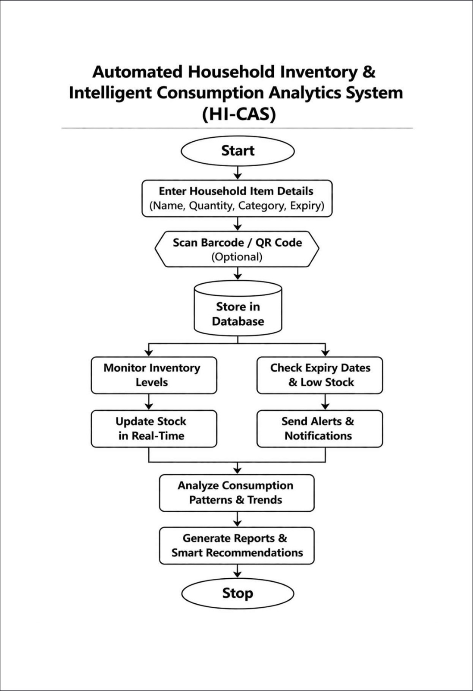
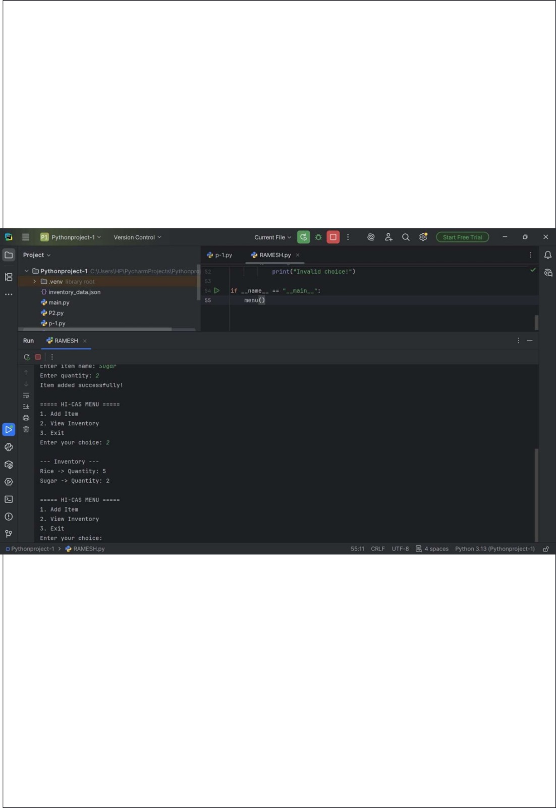

# Automated Household Inventory & Intelligent Consumption Analytics System (HI-CAS)

## Description
The **HI-CAS system** is a Python-based project designed to manage household inventory efficiently and provide intelligent consumption analytics.

It helps users track stock levels, predict refill times, and generate smart recommendations based on usage patterns.

---

## Features
- Add and manage household items
- Track stock and daily usage
- Calculate estimated days left
- Identify low and critical inventory
- Smart refill recommendations
- Consumption analytics system

---

## Technologies Used
- Python
- Object-Oriented Programming (OOP)
- Lists & Dictionaries

---

## Working
1. User inputs item details
2. System calculates days left using:
3. Inventory status is classified:
- 🔴 Critical (≤ 2 days)
- 🟡 Low (≤ 5 days)
- 🟢 Sufficient (> 5 days)
4. Smart recommendations are generated

---

##  Flowchart


---

## 💻 Output


---

## 📂 Project Structure
PY_PROJECT_RAMESH/
│── project_code.py
│── flowchart.jpeg
│── outputs.jpeg
│── README.md

---

## ▶️ How to Run
1. Open project in VS Code
2. Run the file:
   ```bash
   python project_code.py
